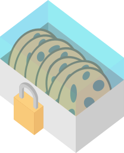

# CookieBox v1.0 [](https://www.npmjs.com/package/cookiebox.js) 
> Only serve the cookies your visitors order!

## The intention
The EU's [GDPR](https://www.eugdpr.org/) and several browser vendors'
[actions against insecure sites](https://thenextweb.com/google/2015/12/17/unsecured-websites-are-about-to-get-hammered-in-googles-search-ranking/)
will and already has changed the way the internet works today. A lot of
websites had to change and now have to use
[certificates](https://en.wikipedia.org/wiki/Transport_Layer_Security)
to allow encrypted communication and page visitors get more attention in
terms of how their data is collected and saved.

**CookieBox** aims to be a drop-in tool for cookie privacy on
[GDPR](https://www.eugdpr.org/) compliant websites.


## What does it do?
At its core **CookieBox** serves as a cookie broker that holds a
whitelist the visitors of your page can set up for themselves.

A page visitor can decide, which of the cookies on *your* website they
want to allow. Only those will eventually get saved on their device.

By default it does not allow any cookie to be set. Any attempt to will
just drop the data that was supposed to be saved as a cookie.


## What does it not do?
1.	Blocking or controlling cookies from other domains is not possible.
1.	As [HTTP Cookies](https://developer.mozilla.org/docs/Web/HTTP/Cookies)
	cannot be managed by [JavaScript](https://www.javascript.com/) by
	design, **CookieBox** also can't offer any kind of functionality
	to block those *yet*, though, based on the success of this tool and
	the effort put into it by the community or the creator, there may be
	a companion tool that runs on the server side at some point in time.

## How does it work?
**CookieBox** runs in your browser. Deep down it overrides the default
function that browsers wrap around their native implementations of the
cookie storage management functions.

**CookieBox** uses a set of [configuration](#configuration) options to
determine how to handle cookies that were not allowed by the visior as
well as allow cookies statically, that *you* - the page administrator -
may need to provide minimal to full site functionality, such as cookies
for an additional cookie banner or similar.>


## Configuration
> see: [Configuration](doc/Configuration.md)

## Behaviours and trivia
### "Paranoia mode"
**CookieHandler** has options that can advise it to hide itself. This is
supposed to be a way to prevent newer embeddable tools from noticing
that **CookieHandler** exists on your website (of course it's not the
perfect solution, but at least it's something) in order to avoid having
them try and override or deactivate **CookieHandler** and harm your
visitors' privacy.


## Example
> see: [Example](example/index.html)


## Installation
**CookieBox** is written in [TypeScript](https://www.typescriptlang.org/)
and transpiled down to [ES5 JavaScript](https://www.ecma-international.org/ecma-262/5.1/).

There are two ways to use **CookieBox**:

1.	[Download or clone](https://help.github.com/articles/cloning-a-repository/)
	this respository and use the generated `.js` file located under
	`/dist/`.

1.	Use [NPM](https://www.npmjs.com/) and install it as follows:

	```shell
	npm install --save cookiebox.js
	```

	Then use whatever tool or framework to either the generated or the
	source JavaScript code into your project or website.

## Contribution
Of course **CookieBox** is not perfect and probably never will be. Thus
contribution by anyone wanting to improve this tool will be appreciated.


## Roadmap
-	Glob / Regex for cookie names (e.g. for Google Analytics cookies with
    variable names)
-	A cleansing option / detection of untracked cookies (for integration and
    debugging)
-	Allow proper integration in TypeScript projects
-	Reduce the configuration madness
-	Improve the way some core features work 
-	Improve documentation
-	Generate docs and example files from source files
	([SASS](https://sass-lang.com/) and such)

### Optional
-	Eventually try to rewrite the code to completely work with the
[strict mode](https://developer.mozilla.org/docs/Web/JavaScript/Reference/Strict_mode).
